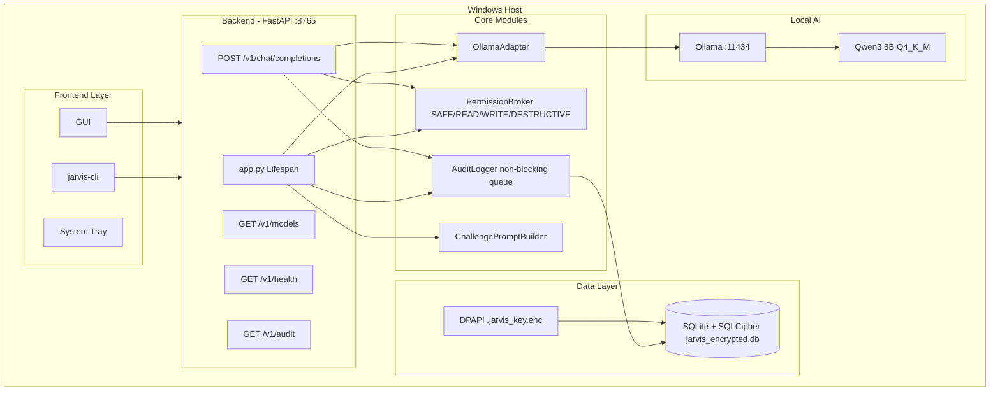

# JARVIS Architecture - Phase 1

## System Overview

```mermaid
graph TB
    subgraph WIN["Windows Host"]
        subgraph FE["Frontend Layer"]
            TRAY["System Tray"]
            GUI["GUI"]
            CLI["jarvis-cli"]
        end
        subgraph BE["Backend - FastAPI :8765"]
            APP["app.py Lifespan"]
            RC["POST /v1/chat/completions"]
            RM["GET /v1/models"]
            RH["GET /v1/health"]
            RA["GET /v1/audit"]
        end
        subgraph CORE["Core Modules"]
            OA["OllamaAdapter"]
            PB["PermissionBroker SAFE/READ/WRITE/DESTRUCTIVE"]
            AL["AuditLogger non-blocking queue"]
            CP["ChallengePromptBuilder"]
        end
        subgraph DATA["Data Layer"]
            DB[("SQLite + SQLCipher jarvis_encrypted.db")]
            KEY["DPAPI .jarvis_key.enc"]
        end
        subgraph RUNTIME["Local AI"]
            OLL["Ollama :11434"]
            LLM["Qwen3 8B Q4_K_M"]
        end
    end
    CLI --> BE
    GUI --> BE
    APP --> OA
    APP --> PB
    APP --> AL
    APP --> CP
    RC --> OA
    RC --> PB
    RC --> AL
    OA --> OLL
    OLL --> LLM
    AL --> DB
    KEY --> DB
```
